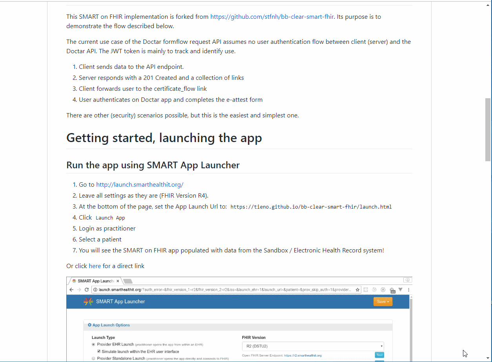

# demo-emd
[](https://travis-ci.com/Tieno/bb-clear-smart-fhir) [](https://github.com/facebook/jest)

- Built with [Vue.js](https://vuejs.org/), continous integration with [Travis](https://travis-ci.org/stfnh/bb-clear-smart-fhir), automated unit tests by [Jest](https://jestjs.io/). Hosted on GitHub Pages (needs to be launched from a SMART on FHIR sandbox, see below).

# Doctar formflow request API - [link here](https://qua-doctarwebtool.azurewebsites.net/Mederi/Doctar.Api/swagger/index.html?urls.primaryName=Public%2FV1)
This SMART on FHIR implementation is forked from https://github.com/stfnh/bb-clear-smart-fhir. Its purpose is to demonstrate the flow described below.

The current use case of the Doctar formflow request API assumes no user authentication flow between client (server) and the Doctar API. The JWT token is mainly to track and identify use.

1. Client sends data to the API endpoint. 
2. Server responds with a 201 Created and a collection of links
3. Client forwards user to the certificate_flow link
4. User authenticates on Doctar app and completes the e-attest form

There are other (security) scenarios possible, but this is the easiest and simplest one.

# Getting started, launching the app

## Run the app using SMART App Launcher

1. Go to http://launch.smarthealthit.org/
2. Leave all settings as they are (FHIR Version R4).
3. At the bottom of the page, set the App Launch Url to: `https://tieno.github.io/bb-clear-smart-fhir/launch.html`
4. Click `Launch App`
5. Login as practitioner
6. Select a patient
7. You will see the SMART on FHIR app populated with data from the Sandbox / Electronic Health Record system!

Or click [here](http://launch.smarthealthit.org/ehr.html?app=https%3A%2F%2Ftieno.github.io%2Fbb-clear-smart-fhir%2Flaunch.html%3Flaunch%3DeyJhIjoiMSIsImYiOiIxIn0%26iss%3Dhttps%253A%252F%252Flaunch.smarthealthit.org%252Fv%252Fr4%252Ffhir&user=) for a direct link



## code @ components/Encounters.vue

```javascript
formflowRequest: function(encounter) {
      var mywindow = window.open(); 
      //we open the window on the UI thread, during the user click event, 
      //so the browser doesn't block it as a popup
      //other solution is to make the request fully synchronous     
      var homeAddress = this.patient.address[0];
      var careDate = null;
      if (encounter != null && encounter.period != undefined) {
        careDate = encounter.period.start.slice(0, 19); //remove timezone
      }
      var inss = this.fakeInss;
      var fakeProvince = "Oost-Vlaanderen";
      var fakeCountry = "Belgium";
      var fakeNihiiCareProvider = "17385467004";
      var gender = 0;
      switch(this.patient.gender)
      {
          case "male":
            gender = 1;
            break;
          case "female":
            gender = 2;
            break;
      }
      return this.$doctarClient
        .post('/certificates/formflow', {
          careDate: careDate,
          CareReceiver: {
            Inss: inss,
            name: this.patient.name[0].family,
            firstName: this.patient.name[0].given.join(' '),
            birthDate: this.patient.birthDate,
            gender: gender,
            email: this.patient.telecom
              .filter(t => t.system == 'email')
              .map(e => {
                if (e.value && e.value.length > 0) {
                  return e.value;
                }
                return '';
              })
              .join(''),
            InsurabilitySituation: {
              CodeEntitled: {
                ct1: '110',
                ct2: '110'
              },
              mutualityCode: 105
            },
            address: {
              street: homeAddress.line.join(' '),
              postalCode: homeAddress.postalCode,
              city: homeAddress.city,
              province: fakeProvince,
              country: fakeCountry
            }
          },
          PackageProvider: {
            name: "demo-fhir-emd"
          },
          CareProvider: {
            Nihii: fakeNihiiCareProvider
          }
        })

        .then(response => response.data)
        .then(data => {
          var link = data.links.find(l => l.rel == 'certificate_flow');
          mywindow.location.href = link.href;
        });
    }
```

## Local setup for development and testing

- Prerequisites: Install current versions of [Node](https://nodejs.org/en) and [Yarn](https://yarnpkg.com/lang/en/) (alternatively npm).

Get a local copy / clone repository:

```
$ git clone git@github.com:stfnh/bb-clear-smart-fhir.git
```

Install the dependencies:

```
$ cd bb-clear-smart-fhir
$ yarn
```

Serve on localhost:

```
$ yarn serve
```

This will use an open access FHIR server for testing, no OAuth2 necessary. For details see the [smartClient implementation](./src/smartClient.js).

Create a production build and [serve](https://github.com/zeit/serve#readme):

```
$ yarn build
$ serve -s dist/
```

You can now test the app using the [SMART App Launcher](http://launch.smarthealthit.org/). Use the URL to launch.html as the APP Launch URL (normally http://localhost:5000/launch.html). This app was also tested with [Cerner's Code Console](https://code.cerner.com/developer/smart-on-fhir/apps).
